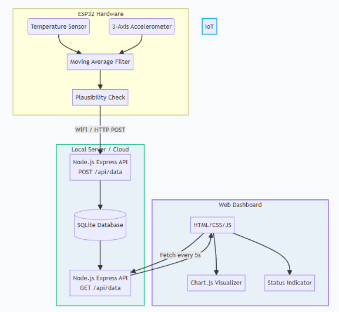

# 🚀 Machine Condition Monitoring System

Welcome to the Machine Condition Monitoring project! 
Imagine you have a big factory machine, and you want to know if it's getting too hot or shaking too much before it breaks. This project uses a tiny computer (an ESP32) to measure the machine's temperature and vibration, and sends that data to a beautiful website where you can monitor it live!

Follow these super simple steps to get it running on your own computer.

---
## 🧰 Technologies Used

<div align="center">

| Domain | Technologies & Libraries |
| :--- | :--- |
| **Hardware & Simulation** |    |
| **Backend** |     |
| **Frontend** |     |
| **Standards & Rules** | **ISO 10816 Standard** (Machine Vibration Evaluation) • **RMS Calculation** |

</div>

---

## 🛠️ What You Need to Install First
Before you start, make sure you have these installed on your computer:
1. **[Node.js](https://nodejs.org/en/download/)**: This runs our backend server. (Download the "LTS" version and install it like a normal program).
2. **VS Code (Visual Studio Code)**: A free code editor to view the files.
3. **No Hardware Needed!** We will simulate the hardware in your web browser using a free website called **Wokwi**.

---

## 🎮 Step-by-Step Guide to Run Everything

### Step 1: Start the Backend Server (The Brain 🧠)
The backend is a small server on your computer that receives the data and saves it.

1. Open this project folder in **VS Code**.
2. Click on **Terminal -> New Terminal** at the top of VS Code.
3. Type this command and press Enter to go into the backend folder:
   ```bash
   cd source_code/backend
   ```
4. Now, type this command and press Enter to start the server:
   ```bash
   npm start
   ```
*(You should see a message saying "Connected to SQLite database" and "Server is running". Leave this terminal open!)*

### Step 2: Create a Magic Tunnel 🚇
Because our hardware simulator is on the internet, it needs a way to talk to your computer. We will create a tunnel!

1. Open a **NEW** terminal in VS Code (click the `+` icon in the terminal window).
2. Type this exact command and press Enter:
   ```bash
   npx localtunnel --port 3000 --subdomain mcmbackend2026
   ```
*(This gives you a public link like `https://mcmbackend2026.loca.lt`. Leave this terminal open too!)*

### Step 3: Open the Dashboard (The Website 💻)
Now let's look at the beautiful dashboard!

1. Open your File Explorer.
2. Go into `source_code` -> `frontend`.
3. Double-click the **`index.html`** file. It will open in Google Chrome or Edge.
*(Right now, the data might be empty. That's normal!)*

### Step 4: Run the Hardware Simulator 🤖
Let's turn on the fake machine!

1. Open your web browser and go to this link: **[Wokwi ESP32 Simulator](https://wokwi.com/projects/new/esp32)**.
2. Go to your VS Code, open the file at `source_code/esp32_node/esp32_node.ino`.
3. Press `Ctrl + A` to select ALL the code, and `Ctrl + C` to copy it.
4. Go back to the Wokwi website, delete all the code there, and **Paste** your code into the window.
5. Click the big green **Play** button on Wokwi!

**Congratulations!** 🎉 Wokwi is now sending fake temperature and vibration data to your server. Go look at your `index.html` dashboard—the charts will start drawing themselves!

---

## 📖 What Does the Data Mean?
- **Temperature:** How hot the machine is (in Celsius). If it goes above 60°C, the dashboard turns Red (Critical!).
- **Vibration (X, Y, Z):** How much the machine is shaking in 3D space.
- **Vibration (RMS):** A special math formula we use to combine X, Y, and Z into one single "Severity Score". If this score is above 1.5, the machine is shaking too violently!

---

## 📊 System Architecture Flowchart
Below is the system architecture flowchart showing the end-to-end data pipeline from the ESP32 IoT sensor node to the backend server and live web dashboard:



---

## 📁 What Are All These Folders?
- `source_code/`: Contains the Backend, Frontend, and ESP32 code.
- `documentation/`: Contains detailed explanations of how the project works.
- `ppt/`: Contains slides you can copy into PowerPoint if you need to present this project.
- `dataset/`: Contains a sample Excel/CSV file of data and a script to generate more.
- `designs_scripts/`: Contains a flowchart diagram of the system.
- `screenshots/` & `hardware_simulation_clips/`: Folders for you to save pictures and videos of your working project!

---

## 🔗 Project References & Useful Links
If you want to learn more about the tools and standards used in this project, check out these links:
- **[Wokwi ESP32 Simulator](https://wokwi.com/)**: The free online tool used to simulate the hardware.
- **[MPU-6050 Datasheet](https://invensense.tdk.com/products/motion-tracking/6-axis/mpu-6050/)**: Information about the 3-axis accelerometer used to detect vibrations.
- **[Node.js](https://nodejs.org/) & [Express.js](https://expressjs.com/)**: The software powering our backend server.
- **[Chart.js](https://www.chartjs.org/)**: The library used to draw the beautiful live graphs on the dashboard.
- **[ISO 10816 Standard](https://www.iso.org/standard/2873.html)**: The industrial standard for evaluating machine vibration (why we use the "RMS" calculation).
